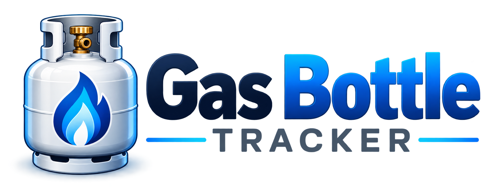

  

# Gas Bottle Tracker

A Home Assistant custom integration for tracking LPG gas bottle usage, estimating remaining bottle life, storing bottle change history, tracking spare bottles, and sending push notifications.

## Features

- Gas bottle size and installation date
- Persistent bottle change history
- Average, median, shortest and longest bottle lifespan
- Estimated days remaining and replacement date
- Remaining percentage
- Average daily gas usage
- Spare bottle tracking
- New bottle and spare bottle services
- Configurable mobile push notifications
- Warning, critical, overdue and spare-empty notifications
- Home Assistant service icons
- Local integration branding

## Installation

### HACS

Add this repository as a custom repository in HACS:

Repository: `https://github.com/coxmitch/gas-bottle-tracker`

Category: Integration

Then install **Gas Bottle Tracker** and restart Home Assistant.

### Manual

Copy the `custom_components/gas_bottle_tracker` directory into your Home Assistant `config/custom_components` directory and restart Home Assistant.

## Setup

Go to **Settings → Devices & services → Add Integration** and search for **Gas Bottle Tracker**.

Configure the bottle name, bottle size, current bottle change date, spare bottles and previous bottle history.

Notification settings are available through the integration's Options menu.

## Services

- `gas_bottle_tracker.new_bottle`
- `gas_bottle_tracker.add_spare`
- `gas_bottle_tracker.remove_spare`
- `gas_bottle_tracker.test_notification`
- `gas_bottle_tracker.check_notifications`

## License

MIT
